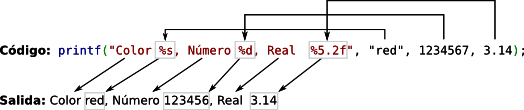

# Como usar el printf

<div align="justify">
    printf es una función especial porque recibe un número variable de parámetros. El primer parámetro es fijo y es la cadena de formato. En ella se incluye texto a imprimir literalmente y marcas a reemplazar por texto que se obtiene de los parámetros adicionales. Por tanto, printf se llama con tantos parámetros como marcas haya en la cadena de formato más uno (la propia cadena de formato). El siguiente ejemplo muestra cómo se imprime el valor de la variable contador.
</div>

```
printf("El valor es %d.\n", contador);
```

<div align="justify">
    El símbolo “%” denota el comienzo de la marca de formato. La marca “%d” se reemplaza por el valor de la variable contador y se imprime la cadena resultante. El símbolo “\n” representa un salto de línea. La salida, por defecto, se justifica a la derecha del ancho total que le hallamos dado al campo, que por defecto tiene como longitud la longitud de la cadena.
<br><br>
Si en la cadena de formato aparecen varias marcas, los valores a incluir se toman en el mismo orden en el que aparecen. La siguiente figura muestra un ejemplo en el que la cadena de formato tiene tres marcas, %s, %d y %5.2f, que se procesan utilizando respectivamente la cadena “red”, el entero 1234567 y el número real 3.14.
<br>
<br>

<br>
<br>

No se comprueba que el número de marcas en la cadena de formato y el número de parámetros restantes sea consistente. En caso de error, el comportamiento de printf es indeterminado.

Las marcas en la cadena de formato deben tener la siguiente estructura (los campos entre corchetes son optativos):
<br>
</div>

```
%[parameter] [flags] [width] [.precision] [length] type
```

<div align="justify">
    Toda marca, por tanto, comienza por el símbolo “%” y termina con su tipo. Cada uno de los nombres (parameter, flags, width, precision, length y type) representa un conjunto de valores posibles que se explican a continuación.
    <br><br>
</div>

| Parametro | Descripcion |
|---|---|
| n$ | Se reemplaza “n” por un número para cambiar el orden en el que se procesan los argumentos. Por ejemplo %3$d se refiere al tercer argumento independientemente del lugar que ocupa en la cadena de formato. |

|Flags | Descripcion |
|---|---|
| Numero | Rellena con espacios (o con ceros, ver siguiente flag) a la izquierda hasta el valor del número. |
| 0 | Se rellena con ceros a la izquierda hasta el valor dado por el flag anterior. Por ejemplo “%03d” imprime un número justificado con ceros hasta tres dígitos. |
| + | Imprimir el signo de un número |
| - | Justifica el campo a la izquierda (por defecto ya hemos dicho que se justifica a la derecha) |
| # | Formato alternativo. Para reales se dejan ceros al final y se imprime siempre la coma. Para números que no están en base 10, se añade un prefijo denotando la base. |

| Width | Descripcion |
|---|---|
| Numero | Tamaño del ancho del campo donde se imprimirá el valor. |
| * | Igual que el caso anterior, pero el número a utilizar se pasa como parámetro justo antes del valor. Por ejemplo printf("%*d", 5, 10) imprime el número 10, pero con un ancho de cinco dígitos (es decir, rellenará con 3 espacios en blanco a la izquierda). |

| Precision | Descripcion |
|---|---|
| Numero | Tamaño de la parte decimal para números reales. Número de caracteres a imprimir para cadenas de texto |
| * | Igual que el caso anterior, pero el número a utilizar se pasa como parámetro justo antes del valor. Por ejemplo printf("%.*s", 3, "abcdef") imprime “abc”. |

| Length | Descripcion |
|---|---|
| hh | Convertir variable de tipo char a entero e imprimir |
| h | Convertir variable de tipo short a entero e imprimir |
| l | Para enteros, se espera una variable de tipo long |
| ll | Para enteros, se espera una variable de tipo long long |
| L | Para reales, se eespera una variable de tipo long double |
| z | Para enterso, se espera un argumento de tipo size_t |

| Type | Descripcion |
|---|---|
| %c | Imprime el caracter ASCII correspondiente |
| %d, %i | Conversion a decimal con signo de un entero |
| %x, %X | Conversion hexadecimal sin signo |
| %p | Direccion de memoria (puntero) |
| %e, %E | Conversiona  coma flotante con signo en notacion cientifica |
| %f, %F | Conversion a coma flotante con signo, usando punto decimal |
| %g, %G | Conversion a coma flotante, usando la notacion que requiera menor espacio |
| %o | Conversion octal sin signo de un entero |
| %u | Conversion decimal sin signo de un entero |
| %s | Cadena de caracteres (terminada en '\0') | 
| %% | Imprime el simbolo % |

#### Acuerdate de poner ``` \n ``` al final de la cadena para que lo imprima con salto de linea


